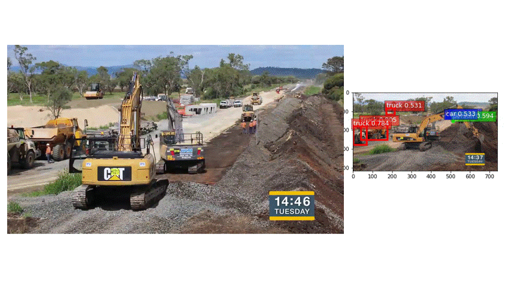

# Mecanismo preventivo de fiscalización en infraestructura pública basado en inteligencia artificial (Contraloría General de la República de Costa Rica)

Una propuesta para el uso de componentes de internet de las cosas, inteligencia artificial y blockchain, como plataforma de habilitación para la participación ciudadana en el proceso de fiscalización de desarrollo de infraestructura pública. 

Al inicio de la pandemia por SARS-COV-2, China realizó la construcción de emergencia de un hospital en Wuhan, epicentro del problema sanitario. Lo sorprendente de esta proeza no fue sólo construir ese centro hospitalario en diez días, sino habilitar al mundo la transmisión por cámaras 24/7 por medio de internet del proceso de construcción , generando una primera experiencia, al menos con esa dimensión, de control ciudadano a nivel global sobre el proceso de desarrollo de infraestructura pública.

Este evento, para efectos del presente estudio, se considera como el génesis de una nueva forma de realizar fiscalización, la forma de hacerlo en la sociedad dentro de la industria 4.0. La industria 4.0 es aquella que hace uso extensivo de varias tecnologías, tales como sensores inteligentes para eficientizar los procesos productivos, y estos avances pueden ser usados por el auditor para generar un control en tiempo real de esos procesos (Dai et al., 2019).

Los principales retos para generar una red como la propuesta son fundamentalmente tres: primero realizar algún tipo de inversión en la adquisición de cámaras que se puedan conectar con la red celular para transmitir las imágenes, sin embargo, el costo de estos equipos cada vez es menor e inclusive existe la posibilidad de construirlos con componentes de open hardware, tales como Arduino o Rapsberry para minimizar la inversión inicial. Como segundo aspecto es desarrollar la interfaz como nodo escritor de la blockchain, que permita a los algoritmos escribir los resultados como parte de una transacción. Por último, desarrollar las interfaces con sistemas de pago, para que mediante smart contracts se generen alertas ante movimientos irregulares. Suplidos estos tres retos, el análisis propiamente de las imágenes es un proceso de implementación relativamente fácil. La anterior afirmación es posible porque el grado de madurez de las bibliotecas de procesamiento de imágenes y de modelo de visión por computadora, es muy alto y permite el uso de estos componentes dentro de los procesos de fiscalización de forma rápida y a muy bajo costo.

